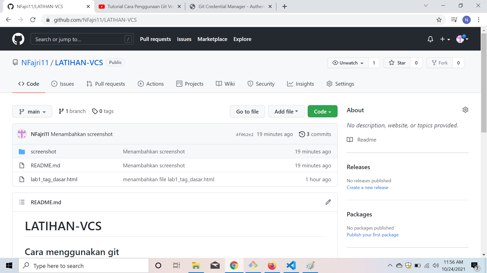

# LATIHAN-VCS
## Cara menggunakan git

### Membuat folder
Buat folder di data D (D) `
`

#### Buka gitbash lalu pindahkan ke folder d/latihan-VCS
Pindahkan ke data D : Latihan-VCS dengan cara "cd /d/Latihan-VCS/ ,lalu lakukan git clone

##### Masuk repository kemudian tambahkan html

###### Buat commit atas file yang ditambahkan

###### Push ke Github
Lakukan push ke github dengan cara mengetik "git push -u origin main" lalu tekan enter

###### Selesai 
file yang telah dipush akan muncul pada repository github 
